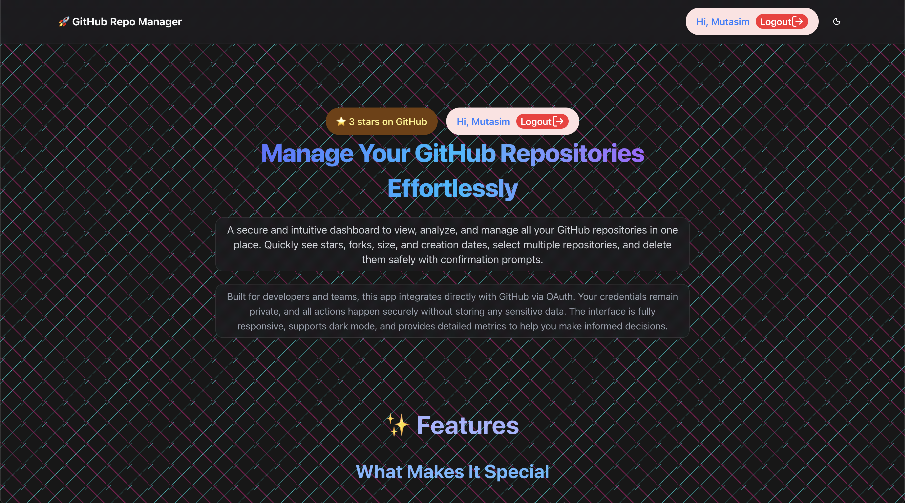
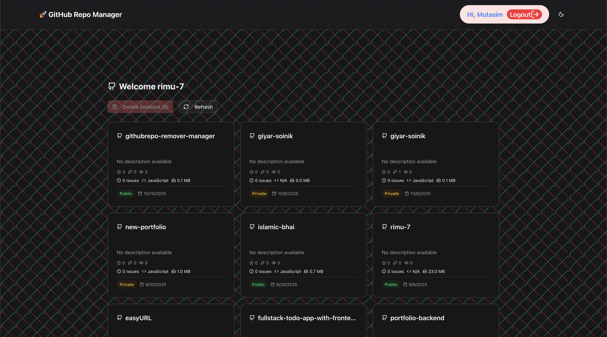

# GitHub Repository Manager



A secure, powerful, and developer-friendly dashboard to manage your GitHub repositories. Quickly view, analyze, and delete repositories in bulk, all while keeping your credentials safe via GitHub OAuth.

---

## Table of Contents

- [Features](#features)  
- [Demo](#demo)  
- [Getting Started](#getting-started)  
- [Usage](#usage)  
- [Technologies](#technologies)  
- [Folder Structure](#folder-structure)  
- [Security & Privacy](#security--privacy)  
- [Contributing](#contributing)  
- [License](#license)  

---

## Features

- **Repository Overview** – View all your repositories with metrics like stars, forks, size, and creation date.  
- **Safe Bulk Deletion** – Select multiple repositories and delete them securely with confirmation prompts.  
- **Smart Selection** – Pick single or multiple repositories effortlessly.  
- **Analytics Dashboard** – Visualize repository stats and growth trends at a glance.  
- **Sorting** – Sort repositories from latest to oldest or vice versa.  
- **Skeleton Loading** – Smooth loading experience with placeholders while data loads.  
- **OAuth Secure** – All actions occur via GitHub OAuth. Your credentials are never stored.  
- **Team Friendly** – Ideal for developers and teams managing multiple repositories.  
- **Dark Mode Support** – Fully responsive and visually adaptive to dark/light themes.  
- **Fast Navigation** – Navigate between dashboard, features, and repositories easily.  

---

## Demo

> **Note:** Replace with your live URL or screenshots.

- [Live Demo](https://githubrepo-remover-manager.vercel.app)  
- Screenshot:



---

## Getting Started

### Prerequisites

- Node.js  
- npm or yarn
- GitHub OAuth App credentials ([create one here](https://github.com/settings/developers))  

### Installation

1. Clone the repository:

```bash
git clone https://github.com/rimu-7/githubrepo-remover-manager.git
cd githubrepo-remover-manager
```

2. Install dependencies:

```bash
npm install
# or
yarn install
#or
pnpm install
```

3. Create a `.env.local` file and add your GitHub OAuth credentials:

```env
GITHUB_ID=your_github_client_id
GITHUB_SECRET=your_github_client_secret
NEXTAUTH_SECRET=your_random_secret_key
```

---

### Run Locally

```bash
npm run dev
# or
yarn dev
#or 
pnpm dev
```

Open [http://localhost:3000](http://localhost:3000) in your browser.

---

## Usage

1. Sign in with GitHub.
2. Browse your repositories on the dashboard.
3. Select single or multiple repositories.
4. Click the **Delete Selected** button to remove repositories safely.
5. View stars, forks, size, and creation date directly on each repository card.
6. Sort repositories by latest/oldest for better management.

---

## Technologies

* [Next.js 15](https://nextjs.org/) – React framework for server-side rendering and routing
* [NextAuth.js](https://next-auth.js.org/) – Authentication via GitHub OAuth
* [React](https://reactjs.org/) – UI library
* [TailwindCSS](https://tailwindcss.com/) – Utility-first CSS framework
* [Shadcn/ui](https://ui.shadcn.com/) – Prebuilt UI components
* [Framer Motion](https://www.framer.com/motion/) – Animations and transitions
* [Sonner](https://github.com/lukasbach/sonner) – Toast notifications

---

## Folder Structure


```
.
├── app
│   ├── api
│   │   ├── auth
│   │   │   └── [...nextauth]
│   │   └── github
│   │       └── delete
│   ├── components
│   │   ├── AuthButtons.jsx
│   │   ├── Dashborad.jsx
│   │   ├── Features.jsx
│   │   ├── Footer.jsx
│   │   ├── ModeToggle.jsx
│   │   ├── Navbar.jsx
│   │   ├── RepoCard.jsx
│   │   └── theme-provider.jsx
│   ├── dashboard
│   │   └── page.jsx
│   ├── favicon.ico
│   ├── globals.css
│   ├── layout.js
│   ├── page.js
│   ├── privacy
│   │   └── page.jsx
│   ├── Providers.js
│   └── terms
│       └── page.jsx
├── banner.png
├── components
│   └── ui
│       ├── accordion.jsx
│       ├── badge.jsx
│       ├── button.jsx
│       ├── card.jsx
│       ├── dropdown-menu.jsx
│       ├── separator.jsx
│       ├── switch.jsx
│       ├── tabs.jsx
│       └── tooltip.jsx
├── components.json
├── dashboard.png
├── eslint.config.mjs
├── jsconfig.json
├── lib
│   ├── fonts.js
│   └── utils.js
├── next.config.mjs
├── package.json
├── pnpm-lock.yaml
├── postcss.config.mjs
├── public
│   ├── file.svg
│   ├── globe.svg
│   ├── next.svg
│   ├── vercel.svg
│   └── window.svg
└── README.md

15 directories, 42 files

```

---

## Security & Privacy

* **OAuth Secure:** The app never stores GitHub credentials.
* **Safe Deletion:** Confirmation prompts prevent accidental repository deletion.
* **Local Processing:** All data is fetched directly from GitHub’s API; nothing is saved to the server.

---

## Contributing

1. Fork the repository.
2. Create a feature branch: `git checkout -b feature/my-feature`
3. Commit your changes: `git commit -m "Add some feature"`
4. Push to branch: `git push origin feature/my-feature`
5. Open a Pull Request

---

## License

This project is licensed under the MIT License. See [LICENSE](./LICENSE) for details.

---

## Contact

* GitHub: [rimu-7](https://github.com/rimu-7)
* Email: [rimux0x@proton.me](mailto:rimux0x@proton.me)

---

```

---

This README.md is **professional, readable, and complete**, covering:  

- Features, usage, and setup instructions  
- Clear folder structure  
- Security emphasis  
- Contribution guidelines  

---
